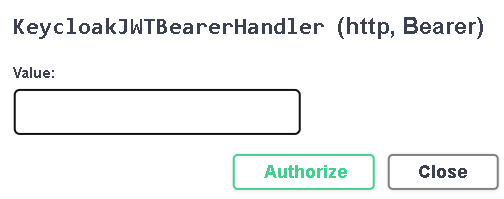
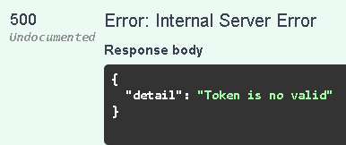
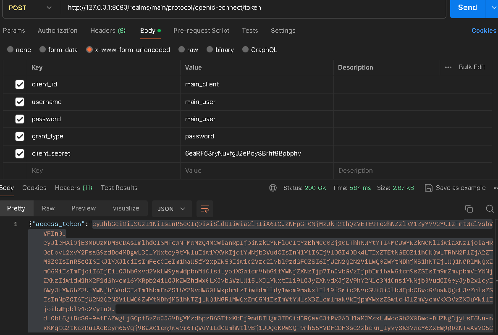
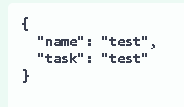

# Лабораторные работы по предмету "Сетевые технолгии" 4 курс

# 2 лабораторная работа
## Концептуальная модель
На основе анализа предметной области «Антикварный магазин», были выделены следующие информационные объекты, которые необходимо хранить в базе данных: ЖАНР (genre_id, genre_name), РЕЖИССЕР (director_id, derector_name), СТРАНА (country_id, country_name), КЛИЕНТ (buyer_id, buyer_name), ФИЛЬМ (film_id, genre_id, country_id, year_publication, available_number), АВТОР (author_id, author_name), МЕНЕДЖЕР (manager_id, login, password).
Каждый из выделенных информационных объектов имеет следующие атрибуты:

 - ЖАНР – название жанра; 
 - СТРАНА – название страны; 
 - РЕЖИССЕР – фамилия, имя; 
 - КЛИЕНТ - фамилия, имя, отчество, телефон, адрес; 
 - ФИЛЬМ – название фильма, год премьеры, доступное количество;
 - МЕНЕДЖЕР – логин, пароль;

## Логическая модель

.png)

## Пользователи
### Клиент
Функциональные возможности:
- Просмотреть все фильмы которые он взял
- Взять копию фильма
- Вернуть фильм
### Менеджер
Функциональные возможности:
- Просмотреть всех клиентов
- Добавить клиента
- Обновить информацию о клиенте
- Удалить клиента
- Просмотреть все фильмы, имеющиеся в магазине
- Добавить новый фильм
- Обновить информацию о фильме
- Удалить фильм

# 3 лабораторная работа

1. Устанавливаем `ufw`  с помощью команды `sudo apt install ufw`, запускаем его `sudo ufw enable`, проверяем запустился ли он с помощью команды `sudo ufw status`. Также сразу добавим правила с портами 1488, 8080, 23 с помощью команды `sudo ufw allow {port number}`

2. Устанавливаем `ssh`, с помощью команды `sudo apt install ssh`, заходим в `sshd_config`.
Запрещаем подключения через root-пользователя и разрешаем только созданному нами пользователю.

Разрешаем своему пользователю подключение

Заходим в **ssh_config**, меняем стандартный порт на 23.

3. Устанавливаем **postgresql** хотя чаще бывает, что **postgresql**  стоит по умолчанию. Для проверки введем команду `sudo systemctl status postgresql`.
Меняем порт для подключения postgresql в файле `postgresql.conf` и меняем **127.0.0.1/32** на **all** в файле `pg_hba.conf`. 
Перезапускаем **postgresql** `systemctl restart postgresql`

Заходим в оболочку postgresql  с помощью команды `sudo -u postgres psql`. Создаем базу данных для keycloak `CREATE DATABASE keycloak OWNER postgres` и создаем пользователя для управления базой данных (можно и оставить стандартного пользователя) `CREATE ROLE keycloak_owner WITH SUPERUSER`

4. Скачиваем zip  архив keycloak с официального сайта, распаковываем его в папку (назовем keycloak). В папке, где распаковали zip архив создаем текстовый файл dockerfile.

Собираем docker image `sudo docker build -f dockerfile -t keycloak_image .`, запускаем docker image `docker run -d -p 8080:8080 keycloak_image`.

5. Переходим на сайт 127.0.0.1:8080. Теперь создаем своего клиента

Создаем свою группу

Добавляем свою realm-role

Добавляем своего пользователя

6. Теперь пишем запросы. Используя HTTP-клиент Postman, нужно протестировать отправку запросов на Keycloak.
Необходимые виды запросов:
- Получение токена по паролю POST
- Получение пользователей GET http://localhost:8080/realms/realm/protocol/openid-connect/userinfo
- Получение токена по refresh токену POST http://localhost:8080/realms/test-realm/protocol/openid-connect/token
- Получение информации про реалм GET http://localhost:8080/realms/test-realm/.well-known/uma2-configuration

# 4 лабораторная работа

Метод **POST** /user – добавление пользователя. Добавляем пользователя do1 с задачей task1.

Метод **GET** /todo – получение задач пользователей.

Метод **DELETE** /todo/{user_id} – удаление пользователя, по заданному id. Удаляем пользователя с id = 2. Если удаление прошло успешно, то возвращается сообщение "the user has been successfully deleted", иначе ошибка 404 – пользователь не найден.

Метод **PUT** /todo/{user_id} – изменение задачи пользователя, по заданному id. Меняем задачу пользователя по id = 1 с write на read. Если изменение прошло успешно, возвращается сообщение "change is complete", иначе ошибка 404 – пользователь не найден.

# 5 Лабораторная работа

**Авторизация с помощью Bearer token**

## Пользователь не авторизован
Если пользователь не авторизован или поле токена пустое, 
то при попытке добавления новой задачи, результатом будет ошибка: **500 - "Token is no valid"**

## Пользователь авторизован

Получение **access_token**

Добавление задачи **test**

Результат: **200 - json объект с добавленой задачей**