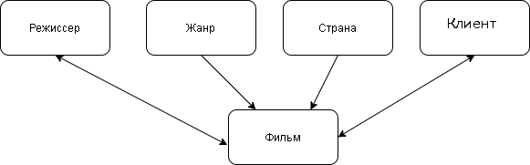

# Лабораторные работы по предмету "Сетевые технолгии" 4 курс
---
# 2 лабораторная работа
<h2>Концептуальная модель</h2>
На основе анализа предметной области «Антикварный магазин», были выделены следующие информационные объекты, которые необходимо хранить в базе данных: ЖАНР (genre_id, genre_name), РЕЖИССЕР (director_id, derector_name), СТРАНА (country_id, country_name), КЛИЕНТ (buyer_id, buyer_name), ФИЛЬМ (film_id, genre_id, country_id, year_publication, available_number), АВТОР (author_id, author_name), МЕНЕДЖЕР (manager_id, login, password).
Каждый из выделенных информационных объектов имеет следующие атрибуты:
ЖАНР – название жанра;
СТРАНА – название страны;
РЕЖИССЕР – фамилия, имя;
КЛИЕНТ - фамилия, имя, отчество, телефон, адрес;
ФИЛЬМ – название фильма, год премьеры, доступное количество;
МЕНЕДЖЕР – логин, пароль; 

<h2>Логическая модель</h2> 

# 3 лабораторная работа

1. Устанавливаем **ufw**  с помощью команды **sudo  apt  install  ufw**, запускаем его **sudo  ufw  enable**, проверяем запустился ли он с помощью команды **sudo  ufw  status**

2. Устанавливаем **ssh**, с помощью команды **sudo  apt  install  ssh**, заходим в **sshd_config**. Запрещаем подключения через root-пользователя и разрешаем только созданному нами пользователю.

Заходим в **ssh_config**, меняем стандартный порт на 23.

3. Устанавливаем postgresql (хотя чаще бывает, что postgresql  стоит по умолчанию). Заходим в оболочку postgresql  с помощью команды **sudo -****u** **postgres** **psql**. Создаем базу данных для keycloak и создаем пользователя для управления базой данных. Меняем порт для подключения postgresql

4. Скачиваем zip  архив keycloak с официального сайта, распаковываем его. В папке, где распаковали keycloak создаем текстовый файл dockerfile.

Собираем docker image, запускаем docker image.
5. Переходим на сайт 127.0.0.1:8080. Теперь создаем своего клиента

Создаем свою группу

Добавляем свою realm-role

Добавляем своего пользователя
